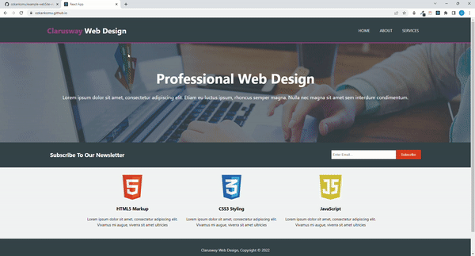

Example site

## Table of contents

  - [The challenge](#the-challenge)
  - [Screenshot](#screenshot)
  - [Project Skeleton ](#project-skeleton)
  - [Links](#links)
  - [Built with](#built-with)
  - [Useful resources](#useful-resources)
  - [Author](#author)

## The challenge
In this project, I tried to make a website for clarusway using reactjs.

## Project Skeleton

   
SOLUTION
├── public
│     └── index.html
├── src
│    ├── components
│    │       ├── header
│    │       │     ├── Header.js
│    │       │     ├── Form.js
│    │       │     └── style.js
│    │       └── navbar
│    │             ├── Navbar.js
│    │             └── style.js
│    ├── pages
│    │       ├── about
│    │       │     ├── About.js
│    │       │     └── style.js
│    │       ├── details
│    │       │     ├── Details.js
│    │       │     └── style.js
│    │       ├── login
│    │       │     ├── Login.js
│    │       │     └── style.js
│    │       └── home
│    │             ├── Home.js
│    │             ├── RecipeCard.js
│    │             └── style.js
│    ├── router
│    │       ├── AppRouter.js
│    │       └── PrivateRouter.js
│    ├── assets
│    │       └── [images]
│    ├── App.js
│    ├── App.css
│    ├── index.js
│    └── index.css
├── package.json
└── yarn.lock

## Screenshot

## Links

<b>Check The Live Website ➡️</b> <a href="https://ozkankomu.github.io/example-webSite-via-react/">Live Website</a>

### Built with
- Semantic HTML5 markup
- CSS
- Mobile-first workflow
- Browser_Router
- React

## Notes

- I used React-Styled-Components , 

### Useful resources

- [W3 Schoold](https://www.w3schools.com/) - This helped me for basics of website paradigm. I really liked this pattern and will use it going forward.
- [MDN](https://developer.mozilla.org/en-US/) - This is an amazing document which helped me finally understand deep sides of web development. I'd recommend it to anyone still learning these concepts.

## Author

- Author - [Ozkan]

 &#8987; Happy Coding  &#9997; 

